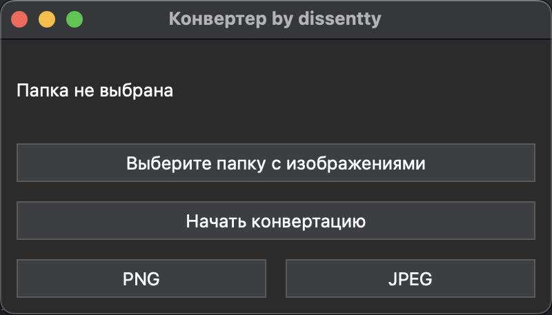

# image converter by dissentty

**image converter** — это приложение с графическим интерфейсом для массовой конвертации изображений в форматы JPEG и PNG. Оно позволяет пользователям легко выбирать папки с изображениями и конвертировать их одним нажатием кнопки, что удобно для работы с большими коллекциями изображений.

## Скриншоты 

## Требования

- Python 3.x
- PyQt5
- Pillow

## Установка

1. Склонируйте репозиторий:
git clone https://github.com/Dissentty/photo_converter

2. Установите необходимые зависимости:
pip install -r requirements.txt

## Запуск приложения

Для запуска приложения выполните следующую команду в терминале:
python app.py

## Использование

1. **Открытие приложения**: Запустите `app.py`, чтобы открыть графический интерфейс.
2. **Выбор папки**: Нажмите кнопку «Выберите папку с изображениями» и выберите папку, содержащую изображения для конвертации.
3. **Выбор формата**: В приложении выберите целевой формат (JPEG или PNG).
4. **Начало конвертации**: Нажмите кнопку «Начать конвертацию», и все изображения в выбранной папке будут сконвертированы в указанный формат и сохранены в папке вывода.

## Сборка исполняемого файла

Если вам нужно скомпилировать проект в исполняемый файл (например, для Windows):

1. Установите PyInstaller:
pip install pyinstaller

2. Выполните команду для сборки:
pyinstaller --icon icon.ico --onefile --windowed app.py

Сборка исполняемого файла производится под операционную систему на который вы его собираете.

## Лицензия

Этот проект распространяется под лицензией MIT. Подробности смотрите в файле LICENSE.

---

## Авторы

- dissentty